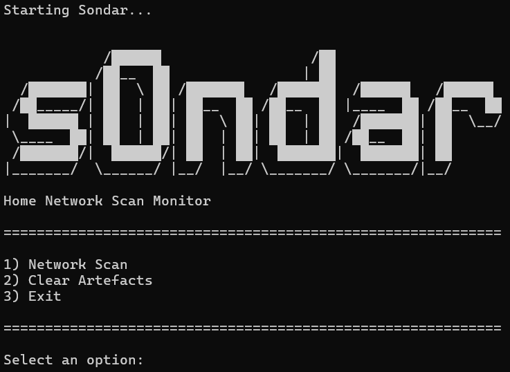
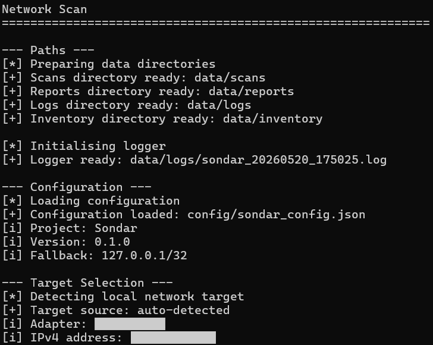
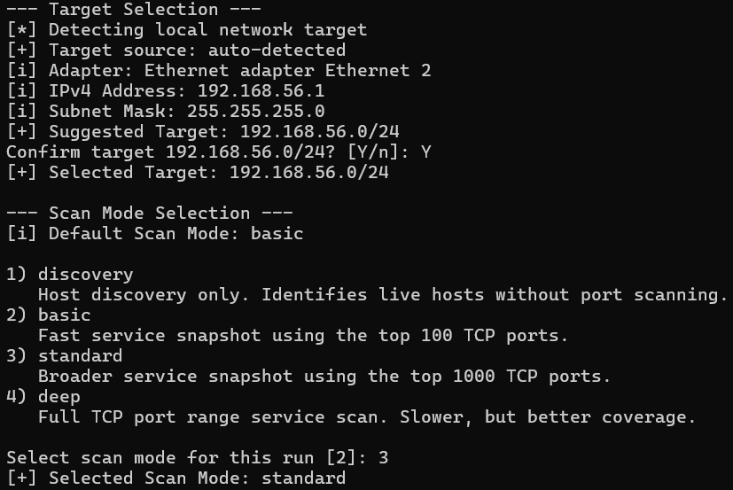
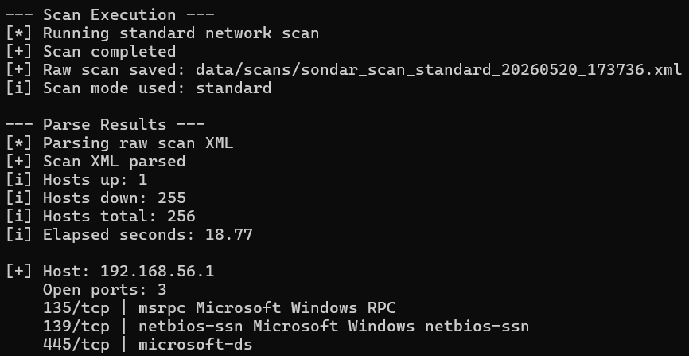
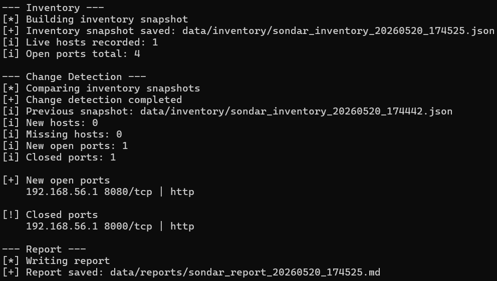
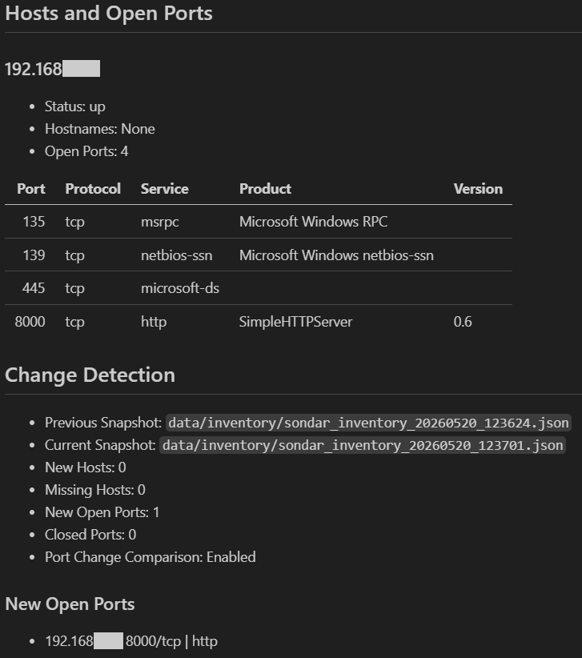
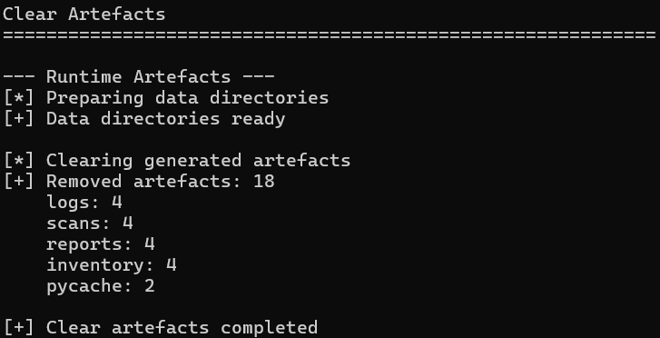

# Sondar

**Turns Nmap scan output into host inventory, service change evidence, and readable reports.**

Sondar is a Python-based network visibility workflow for authorised lab and small-network environments. It detects a local network target, asks the operator to confirm or override the CIDR range, runs a selected Nmap scan profile, parses XML output, builds inventory snapshots, compares changes between runs, and generates Markdown reports.

The project addresses a practical visibility problem:

> A scan shows what is visible at one point in time. Sondar preserves that evidence, turns it into inventory state, and compares future scans so host and service changes can be reviewed.

Sondar keeps the scan scope explicit. The operator sees the detected target, confirms or overrides it, selects the scan depth for that run, and receives structured artefacts that can be inspected after execution.

---

## Purpose

Sondar focuses on the workflow around network scanning rather than treating a scan as a one-off terminal command. The aim is to show how raw scan output can become repeatable operational evidence through target confirmation, structured parsing, inventory snapshots, comparison logic, and reporting.

• **Network Visibility**  
  Sondar identifies live hosts and exposed services using selected Nmap scan profiles. The results are presented through clean terminal output and preserved in artefacts that can be reviewed later.

• **Operator Control**  
  The workflow detects a suggested CIDR range, displays adapter and subnet evidence, and requires confirmation or manual override before any scan is executed.

• **Structured Evidence**  
  Raw XML is preserved first, then parsed into host and service data, normalised into JSON inventory snapshots, and summarised in Markdown reports.

• **Change Detection**  
  Current inventory state is compared against the previous snapshot to identify new hosts, missing hosts, newly open ports, and closed ports.

• **CLI Engineering**  
  The project demonstrates Python command-line workflow design, subprocess execution, XML parsing, JSON artefact handling, scan profile control, runtime cleanup, logging, and clean repository-relative output.

---

## Screenshot Evidence

The screenshots below show Sondar running end-to-end as an operator-facing workflow. They are included to show the tool operating through target selection, scan execution, inventory generation, change detection, reporting, and cleanup rather than only describing the architecture.

### Operator Menu



The operator menu provides a controlled entry point for network scanning, artefact cleanup, and workflow exit. This keeps the tool usable from a single launcher rather than relying on separate one-off commands.

### Host Configuration



The host configuration stage prepares runtime directories, initialises logging, and loads the configuration file before scan execution. Repository-relative paths keep terminal output clean while still showing where generated artefacts are stored.

### Scan Configuration



The scan configuration stage detects the local IPv4 target, shows adapter and subnet evidence, asks for confirmation, and lets the operator choose the scan profile for the current run.

### Scan Execution



The scan execution stage runs the selected Nmap profile, saves raw XML output, parses live hosts, and prints detected service exposure. This demonstrates the path from external scan command to structured terminal output.

### Change Detection



The change detection stage compares the current inventory snapshot against the previous snapshot and reports host or service changes. This shows Sondar performing state comparison rather than only running a single scan.

### Markdown Report



The Markdown report turns scan and comparison output into a readable review artefact. It summarises scan scope, host inventory, open services, previous snapshot context, and detected changes.

### Clear Artefacts



The cleanup workflow removes generated logs, scans, reports, inventory snapshots, and Python cache folders while preserving repository structure.

---

## Technical Capabilities

Sondar is built as a modular CLI workflow rather than a single scanning script. Each capability supports visibility, repeatability, safer operator control, or reviewable evidence.

| Area | Implementation |
|---|---|
| Core Stack | Python standard library, Windows batch launcher, Nmap XML output, JSON inventory snapshots, Markdown reporting, timestamped logs, and repository-relative runtime paths. |
| Target Handling | Parses Windows interface data, identifies a usable IPv4 address and subnet mask, calculates a CIDR target, and requires operator confirmation before scan execution. |
| Scan Control | Supports discovery, basic, standard, and deep scan profiles selected per run, allowing scan depth to change without permanently editing the configuration file. |
| XML Processing | Parses Nmap XML into structured host, hostname, port, protocol, state, service, product, version, CPE, and run-statistics data. |
| Inventory State | Converts parsed scan results into timestamped JSON inventory snapshots with metadata describing scan mode and port-scan availability. |
| Change Detection | Compares inventory snapshots by host IP and protocol/port keys to identify new hosts, missing hosts, newly open ports, and closed ports. |
| Scan Context | Tracks whether a scan profile collected port data so discovery scans do not create false closed-port findings when compared against service scans. |
| Reporting | Generates Markdown reports containing scan summary, host inventory, open service tables, previous snapshot reference, and detected changes. |
| Artefact Control | Stores raw scans, logs, reports, and inventory snapshots under `data/`, then clears generated runtime artefacts while preserving `.gitkeep` placeholders. |

---

## Architecture

The architecture separates target detection, scan execution, XML parsing, inventory creation, change detection, report generation, logging, and artefact cleanup. This modularity makes the project easier to inspect, test, explain, and extend.

```text
sondar.bat
│   Launches the interactive operator workflow from the repository root.
│   Checks Python and Nmap availability before opening the menu.
│
config/
│   └── sondar_config.json
│       Stores default scan behaviour, target confirmation settings,
│       timeout values, and scan profile descriptions.
│
data/
├── scans/
│   Stores raw Nmap XML scan artefacts.
│
├── inventory/
│   Stores normalised JSON inventory snapshots.
│
├── reports/
│   Stores generated Markdown scan reports.
│
└── logs/
    Stores timestamped runtime logs.
│
src/
├── sondar_main.py
│   Provides menu operation, workflow orchestration, target confirmation,
│   per-run scan mode selection, and stage-level terminal output.
│
├── core/
│   ├── sondar_network.py
│   │   Detects local IPv4 interface data and calculates a suggested CIDR target.
│   │
│   ├── sondar_scanner.py
│   │   Builds Nmap commands from scan profiles and writes raw XML output.
│   │
│   ├── sondar_parser.py
│   │   Parses Nmap XML into structured host, port, service, and run data.
│   │
│   ├── sondar_inventory.py
│   │   Builds normalised JSON inventory snapshots from parsed scan data.
│   │
│   ├── sondar_detector.py
│   │   Compares inventory snapshots and reports host or service changes.
│   │
│   ├── sondar_reporter.py
│   │   Generates Markdown reports from scan, inventory, and change data.
│   │
│   └── sondar_artefacts.py
│       Clears generated runtime artefacts while preserving repository structure.
│
└── utils/
    ├── sondar_banner.py
    │   Provides the ASCII logo, headers, section labels, and status markers.
    │
    ├── sondar_logger.py
    │   Creates timestamped runtime logs.
    │
    └── sondar_paths.py
        Centralises repository paths and clean relative path output.
```

Each layer communicates through structured Python dictionaries, JSON artefacts, XML files, or Markdown reports. Raw scan evidence is preserved, while derived artefacts make the results easier to inspect without re-running the scan.

---

## Workflow

Sondar follows an explicit evidence chain from target selection to report generation. The scan does not begin until the target has been displayed and confirmed by the operator.

```text
Target Detection -> Target Confirmation -> Scan Profile Selection -> Nmap XML Collection -> XML Parsing -> Inventory Snapshot -> Change Detection -> Markdown Report
```

The workflow keeps scan scope visible before execution and preserves each output stage for review. Raw XML remains available as original evidence, JSON inventory snapshots preserve comparable state, and Markdown reports provide readable summaries for manual inspection.

---

## Operation

Sondar can be run through the Windows launcher or directly through Python command-line flags. The launcher is the intended workflow because it performs dependency checks before opening the operator menu.

| Action | Behaviour |
|---|---|
| Network Scan | Detects the local target, asks for confirmation or manual CIDR override, selects the scan mode for the current run, executes Nmap, parses XML, creates inventory, detects changes, and writes a report. |
| Clear Artefacts | Removes generated logs, scan XML files, Markdown reports, inventory snapshots, and Python cache directories while preserving repository placeholders. |
| Exit | Closes the operator menu cleanly. |

Sondar supports four scan profiles. The default mode is loaded from configuration, but the operator can override it during each run without permanently changing `sondar_config.json`.

| Scan Mode | Nmap Behaviour | Use Case |
|---|---|---|
| `discovery` | `nmap -sn` | Host discovery without port scanning. |
| `basic` | `nmap -sV --top-ports 100` | Fast service snapshot using common TCP ports. |
| `standard` | `nmap -sV --top-ports 1000` | Broader service review with wider port coverage. |
| `deep` | `nmap -sV -p-` | Full TCP range service scan for authorised deeper review. |

Generated artefacts are stored under `data/` so the workflow can be reviewed after execution.

• **Raw XML**  
  Stored in `data/scans/`. This preserves original Nmap output for review, troubleshooting, and re-parsing.

• **Inventory JSON**  
  Stored in `data/inventory/`. This preserves normalised host and service state so future scans can be compared.

• **Markdown Report**  
  Stored in `data/reports/`. This provides a readable scan and change detection summary.

• **Runtime Log**  
  Stored in `data/logs/`. This records workflow activity, selected target, scan mode, and generated output paths.

Run from the repository root:

```bat
sondar.bat
```

Direct commands are also supported:

```bat
python src\sondar_main.py --scan
python src\sondar_main.py --clear-artefacts
```

---

## Technical Method

Sondar uses Nmap as the scan engine because Nmap already provides mature host discovery, port scanning, service detection, and XML output. Sondar focuses on the controlled workflow around that engine: target confirmation, profile selection, artefact preservation, parsing, inventory state, comparison, and reporting.

• **Target Detection**  
  Windows interface output is parsed to identify IPv4 address and subnet data. Python `ipaddress` then calculates the suggested CIDR range, which is displayed to the operator before scanning.

• **Scan Execution**  
  Python `subprocess` runs the selected Nmap command with XML output enabled. The raw XML file is written to `data/scans/` before any parsing or interpretation happens.

• **XML Parsing**  
  Python `xml.etree.ElementTree` extracts hosts, addresses, hostnames, ports, services, versions, CPEs, and run statistics from the Nmap XML file.

• **Inventory Creation**  
  Parsed scan data is normalised into a timestamped JSON snapshot. The inventory includes scan mode metadata and a flag showing whether the selected profile collected port data.

• **Change Detection**  
  Previous and current inventories are indexed by host IP and protocol/port keys. Sondar then compares those indexes to identify host and service state changes.

• **Report Generation**  
  Scan metadata, inventory summary, host tables, and change results are assembled into a Markdown report that can be opened in VS Code preview or viewed directly on GitHub.

---

## Setup

Sondar currently uses Python standard-library modules only. No Python packages need to be installed with pip, but Nmap must be installed and available in PATH.

| Requirement | Detail |
|---|---|
| Python | Required to run the Sondar workflow. Python 3.13 was used during development. |
| Nmap | Required as the external scan engine. It must be installed and available in PATH. |
| Windows | The launcher and interface parsing are currently Windows-focused. |

Check dependencies:

```bat
python --version
nmap --version
```

Launch the operator workflow:

```bat
sondar.bat
```

Configuration is stored in:

```text
config/sondar_config.json
```

The configuration file stores defaults for target handling, scan confirmation, manual override behaviour, default scan mode, profile descriptions, and timeout values. Runtime prompts decide the actual target and scan profile for each run.

---

## Project Status

Current status: **functional lab implementation**.

• **Implemented Workflow**  
  Sondar currently includes the interactive operator menu, Windows launcher, Python and Nmap checks, target detection, target confirmation, manual CIDR override, per-run scan mode selection, and direct command flags.

• **Scan Processing**  
  The tool runs Nmap XML scans, parses host and service output, builds timestamped JSON inventory snapshots, and stores raw scan evidence for later review.

• **Comparison Logic**  
  Change detection currently supports new hosts, missing hosts, newly open ports, and closed ports. Discovery-aware metadata prevents false port-change results when discovery scans are compared with service scans.

• **Reporting & Cleanup**  
  Markdown report generation, timestamped logging, repository-relative output paths, runtime artefact cleanup, and Python cache cleanup are implemented.

• **Future Development**  
  Future improvements could include friendly device labels, CSV inventory export, pinned baseline comparison, service exposure scoring, multi-adapter selection, richer CPE reporting, or HTML report output.

---

## Limitations

Sondar reports observed network state from Nmap output. It does not confirm exploitability, validate vulnerabilities, perform credentialed checks, capture packets, or attempt exploitation.

• **Authorised Scope**  
  Sondar is intended for networks the operator is authorised to scan. The workflow asks for target confirmation, but permission and scope remain the operator's responsibility.

• **Observed State**  
  Results represent what Nmap observed during that scan. Firewalls, host configuration, network conditions, and scan profile selection can affect visibility.

• **Vulnerability Context**  
  Sondar identifies exposed services and service changes. It does not prove whether a service is vulnerable, exploitable, or intentionally exposed.

• **Discovery Data**  
  Discovery scans do not collect port data. Sondar handles this by skipping port change comparison when one or more compared snapshots do not include port scan data.

• **Platform Focus**  
  The current target detection logic is Windows-focused because it parses Windows interface output. Cross-platform interface detection would require additional platform-specific handling.

---

## Licence

MIT License. See `LICENSE`.
