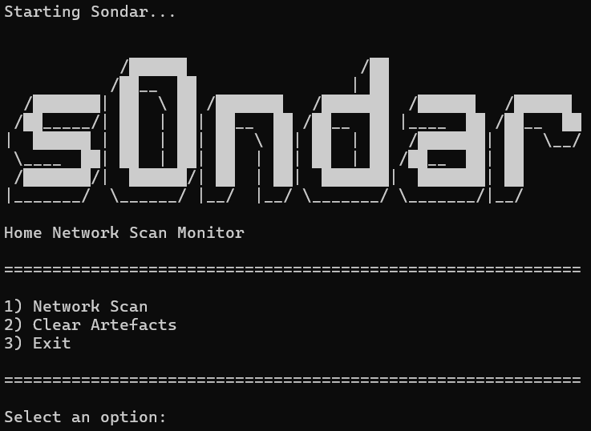
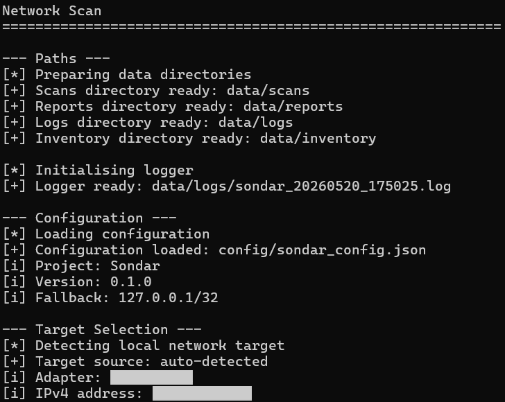
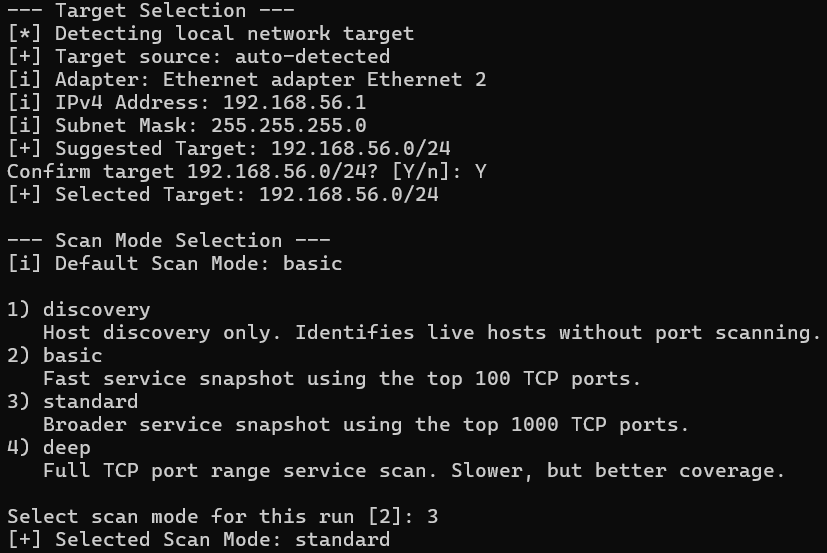
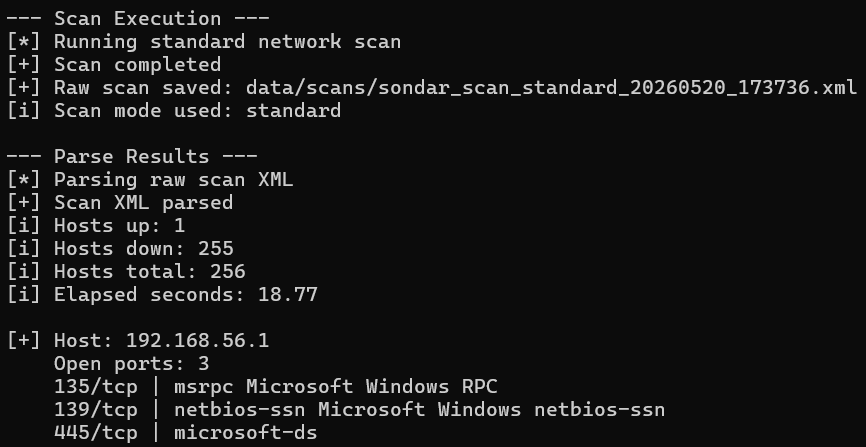
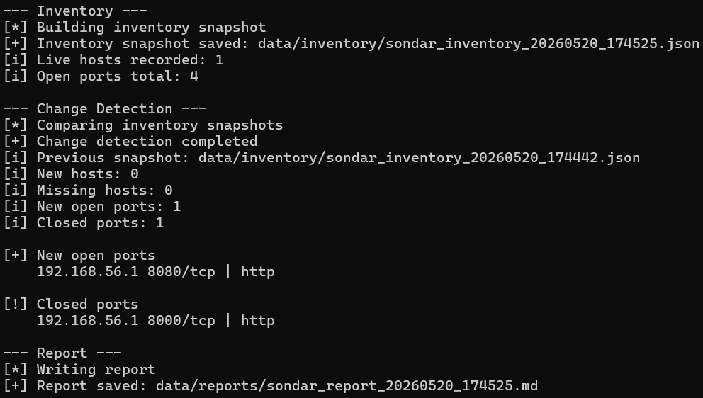
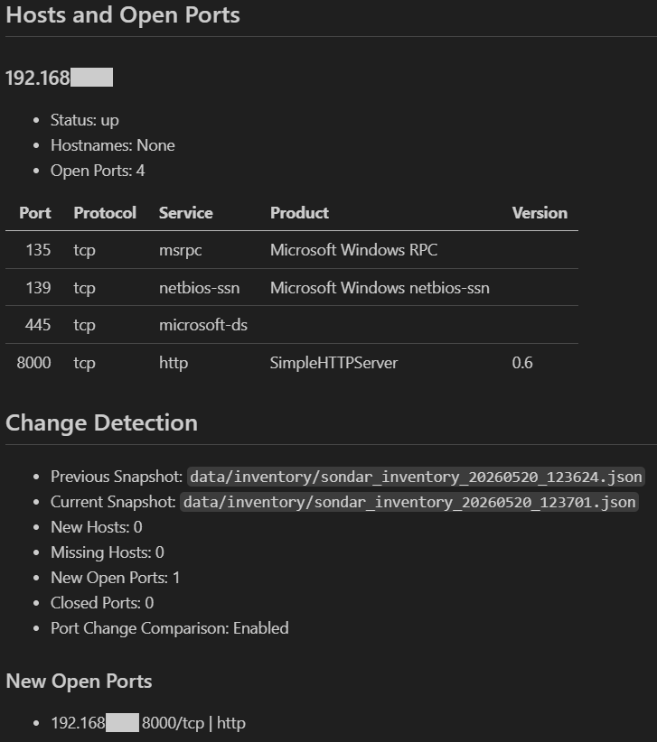
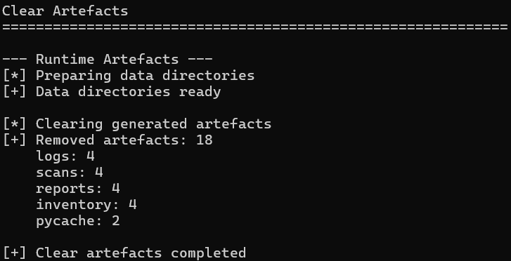

# Sondar

**Turns authorised Network Mapper (Nmap) scans into host inventory, service change evidence, and readable reports for small-network review.**

Sondar is a Python network visibility tool for authorised lab and small-network environments. It detects a local network target, asks the operator to confirm or override the Classless Inter-Domain Routing (CIDR) range, runs a selected Nmap scan profile, parses Extensible Markup Language (XML) output, builds JavaScript Object Notation (JSON) inventory snapshots, compares changes between runs, and generates Markdown reports.

The project exists because a network scan is useful at one point in time, but support work often needs a record that can be reviewed later.

> A scan shows what is visible now. Sondar preserves that evidence, turns it into inventory state, and compares future scans so host and service changes can be reviewed.

Sondar does not exploit services, validate vulnerabilities, capture traffic, or replace enterprise monitoring. Its role is controlled scan execution, evidence preservation, change detection, and reporting for authorised environments.

---

## Skills Demonstrated

Sondar shows practical network troubleshooting, scan control, evidence handling, scripting, and technical documentation.

• **Network Visibility**  
Identifies live hosts and exposed services from authorised Nmap scans, then presents the result through terminal output and stored artefacts.

• **Target Confirmation**  
Detects local adapter evidence, calculates a suggested CIDR range, and requires operator confirmation before scan execution.

• **Scan Evidence Handling**  
Preserves raw XML output, normalised JSON inventory, Markdown reports, and runtime logs for later review.

• **Change Detection**  
Compares inventory snapshots to identify new hosts, missing hosts, newly open ports, and closed ports between scan runs.

• **Command-Line Workflow**  
Uses Python for menu control, subprocess execution, XML parsing, JSON handling, report generation, cleanup, and repository-relative output.

---

## Architecture

Sondar separates launch, configuration, target detection, scan execution, parsing, inventory state, change detection, reporting, cleanup, and generated evidence.

```text
sondar.bat
│   Starts Sondar from the repository root.
│   Checks Python and Nmap before opening the menu.
│
├── config/
│   └── sondar_config.json
│       Stores default scan behaviour, target confirmation,
│       timeout values, and scan profile descriptions.
│
├── src/
│   ├── sondar_main.py
│   │   Runs the menu, scan workflow, target confirmation,
│   │   scan profile selection, and stage output.
│   │
│   ├── core/
│   │   Handles network detection, Nmap execution,
│   │   XML parsing, inventory creation, change detection,
│   │   report generation, and artefact cleanup.
│   │
│   └── utils/
│       Handles banner output, runtime logging,
│       repository paths, and clean path display.
│
├── data/
│   ├── scans/
│   │   Stores raw Nmap XML scan output.
│   │
│   ├── inventory/
│   │   Stores normalised JSON inventory snapshots.
│   │
│   ├── reports/
│   │   Stores generated Markdown reports.
│   │
│   └── logs/
│       Stores timestamped runtime logs.
│
└── assets/
    └── *.png
        Stores README screenshots.
```

The scan follows this evidence chain:

```text
Target Detection -> Target Confirmation -> Scan Profile Selection -> Nmap XML Collection -> XML Parsing -> Inventory Snapshot -> Change Detection -> Markdown Report
```

---

## Screenshots

The screenshots below show the main scan workflow, report output, and artefact cleanup.

### Operator Menu



The launcher provides menu options for network scanning, generated artefact cleanup, and workflow exit.

### Run Scan



Sondar prepares runtime folders, initialises logging, and loads configuration before scan execution.



Sondar detects local adapter evidence, proposes a CIDR target, and asks the operator to confirm or override the scan range.



Sondar runs the selected Nmap profile, saves raw XML output, parses live hosts, and prints detected service exposure.



Sondar compares the latest inventory snapshot against the previous run and reports host or service changes.

### Report Output



The Markdown report summarises scan scope, host inventory, open services, previous snapshot context, and detected changes.

### Clear Artefacts



The cleanup workflow removes generated scans, reports, inventory snapshots, logs, and cache files while preserving repository structure.

---

## Demo

Sondar is intended to be reviewed from the Windows launcher. The launcher keeps the workflow in one place and checks the required tools before opening the menu.

### 1. Check Requirements

| Requirement | Reason |
|---|---|
| Windows | Required for the current launcher and adapter parsing logic. |
| Python | Runs the Sondar menu, scan workflow, parser, and reporter. |
| Nmap | Provides host discovery, service detection, and XML output. |

Check dependencies:

```bat
python --version
nmap --version
```

### 2. Start Sondar

Run from the repository root:

```bat
sondar.bat
```

### 3. Run Network Scan

Use the menu option:

```text
Network Scan
```

The scan detects a target range, asks for confirmation, lets the operator choose a scan profile, runs Nmap, parses the result, creates inventory state, checks for changes, and writes a report.

### 4. Select Scan Profile

| Scan Mode | Nmap Command | Use Case |
|---|---|---|
| `discovery` | `nmap -sn` | Host discovery without port scanning. |
| `basic` | `nmap -sV --top-ports 100` | Fast service snapshot using common ports. |
| `standard` | `nmap -sV --top-ports 1000` | Broader service review with wider coverage. |
| `deep` | `nmap -sV -p-` | Full Transmission Control Protocol (TCP) range scan. |

### 5. Review Output

| Output | Content | Location |
|---|---|---|
| Raw Scan | Original Nmap XML output from the scan run. | `data/scans/` |
| Inventory Snapshot | Normalised host and service state for comparison. | `data/inventory/` |
| Markdown Report | Readable report covering scope, services, and changes. | `data/reports/` |
| Runtime Log | Timestamped workflow log with target and output paths. | `data/logs/` |

### 6. Clear Generated Artefacts

Use the menu option:

```text
Clear Artefacts
```

This removes generated scans, reports, inventory snapshots, logs, and Python cache files while preserving repository placeholders.

---

## Limitations

Sondar reports observed network state from Nmap output. It does not prove exploitability, validate vulnerabilities, capture packets, or attempt exploitation.

• **Authorised Scope**  
The tool should only be used on networks the operator is allowed to scan.

• **Observed Scan State**  
Results represent what Nmap observed during that run. Firewalls, host settings, network conditions, and scan depth can affect visibility.

• **Vulnerability Context**  
Sondar identifies exposed services and service changes. It does not prove that a service is vulnerable, exploitable, or intentionally exposed.

• **Discovery Scan Scope**  
Discovery scans do not collect port data. Sondar avoids false port-change findings when compared snapshots do not both contain port results.

• **Windows Focus**  
The current target detection logic is Windows-focused because it parses Windows interface output.

---

## Licence

MIT License. See `LICENSE`.
